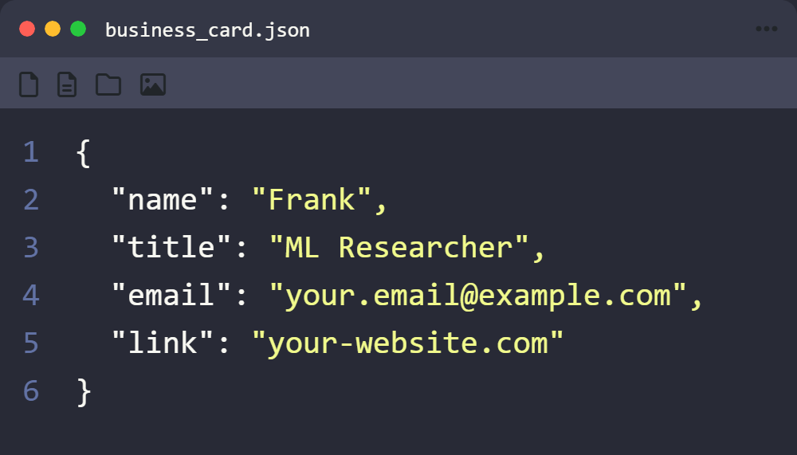

# IDE Business Card Generator

A static web application that creates customizable IDE-style business cards that can be exported as PNG images.

## Features

- Create personalized IDE-style business cards
- Customize key-value pairs with your own information
- Choose between JSON and YAML formats
- Select from multiple IDE color themes
- Export as PNG with proper business card proportions
- Responsive design that works on both desktop and mobile

## Usage

1. Edit the key-value pairs on the right panel to customize your card
2. Add or remove fields as needed
3. Choose your preferred format (JSON or YAML)
4. Select a theme that matches your style
5. Click "Export PNG" to download your card

## Available Themes

- Dark (VS Code default)
- Light
- Monokai
- GitHub
- Tomorrow Night
- Dracula

## Deployment

This is a static website that can be easily deployed to GitHub Pages:

1. Fork this repository
2. Go to your repository settings
3. Navigate to Pages section
4. Choose the branch you want to deploy (usually `main`)
5. Set the folder to `/` (root) or `/src`
6. Click Save

Your IDE Business Card Generator will be available at `https://[your-username].github.io/IDE-Business-Cards/`

## Local Development

To run this project locally:

1. Clone the repository
2. Open the project folder
3. Open `src/index.html` in your browser

No build steps or server are required as this is a pure HTML/CSS/JavaScript application.

## License

MIT

## Credits

Created with ❤️ using HTML, CSS, and vanilla JavaScript.
