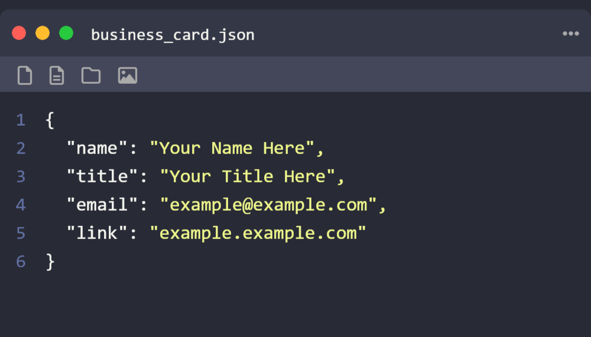

# IDE 风格名片生成器

[English README](README.md)

一个静态 Web 应用程序，用于创建可自定义的 IDE 风格名片，并可将其导出为 PNG 图像。

## 特性

- 创建个性化的 IDE 风格名片
- 使用您自己的信息自定义键值对
- 可选择 JSON、YAML 和 Properties 格式
- 多种 IDE 颜色主题可选
- 自定义卡片预览的字体大小和行高
- 自定义卡片标题栏中的文件名部分
- 可切换标题栏中文件扩展名的可见性
- 以标准名片比例导出为 PNG 图像

## 使用方法

1.  在“自定义您的名片”区域编辑键值对。
2.  根据需要使用“添加字段”按钮添加或删除字段。
3.  在“卡片样式选项”下：
    *   选择您偏好的格式（JSON、YAML 或 Properties）。
    *   选择符合您风格的主题。
    *   调整卡片预览的“字体大小 (px)”和“行高”。
    *   自定义卡片标题栏中显示的“文件名”。
    *   使用“显示扩展名”开关来显示或隐藏标题中的文件扩展名。
4.  点击“导出 PNG”下载您的名片。

## 可用主题

- Dark (VS Code 默认)
- Light
- Monokai
- GitHub
- Tomorrow Night
- Dracula (默认)

## 部署

这是一个静态网站，可以轻松部署到 GitHub Pages：

1.  Fork 此仓库。
2.  进入您的仓库设置。
3.  导航到 Pages 部分。
4.  选择您要部署的分支（通常是 `main`）。
5.  将文件夹设置为 `/` (根目录)。
6.  点击保存。

您的 IDE 风格名片生成器将通过 `https://[您的用户名].github.io/IDE-Business-Cards/` 访问。

## 本地开发

要在本地运行此项目：

1.  克隆此仓库。
2.  打开项目文件夹。
3.  在浏览器中打开 `index.html`。

由于这是一个纯 HTML/CSS/JavaScript 应用程序，因此不需要构建步骤或服务器。

## 许可证

MIT

## 致谢

使用 HTML、CSS 和原生 JavaScript ❤️ 精心制作。